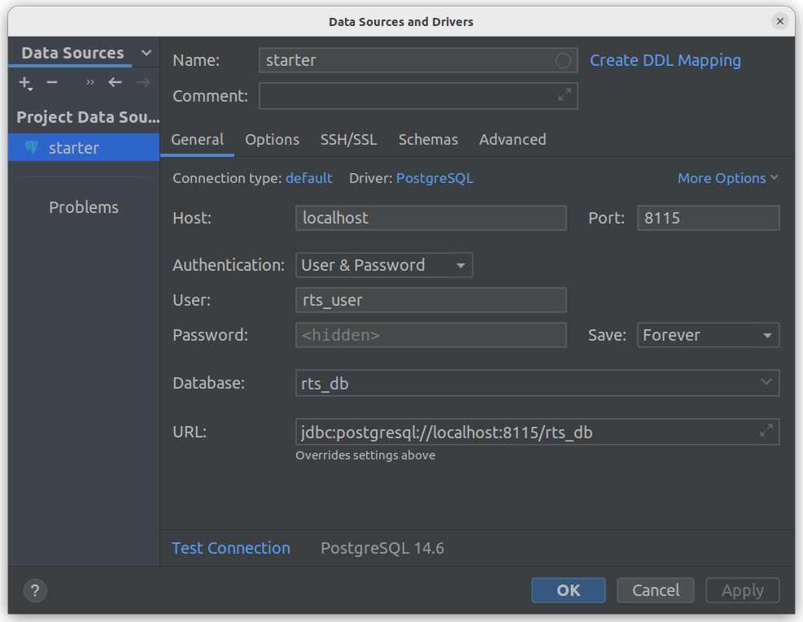

# Symfony Project Starter

Compact turnkey solution for starting a Symphony project based on Docker

## Under the hood
- API testing
- PHP CS Fixer
- filling the database from fixtures or dump
- console command to initiate the database
- fixture sample
- PHP: 8.1.13
- Postgresql: more or equal 14
- Nginx: last version
- Utils: xdebug, apcu, opcache


## Start project

#### From Packagist
```shell
cd my/projects
composer create-project reiterus/starter-symfony
docker-compose up -d --build
docker-compose exec php bin/console app:init:db
```

#### From GitHub
```shell
cd my/projects
git clone https://github.com/reiterus/starter-symfony.git
docker-compose up -d --build
docker-compose exec php composer install
docker-compose exec php bin/console app:init:db
```


## Database from PhpStorm



## Shell command hints

#### Run UnitTest
```shell
# all tests
docker-compose exec php ./vendor/bin/phpunit

# only one class
docker-compose exec php ./vendor/bin/phpunit tests/Controller/HomeControllerTest.php

# only one class method
docker-compose exec php ./vendor/bin/phpunit tests/Controller/HomeControllerTest.php --filter testHomeUri
```

#### Run PHP Cs Fixer
```shell
# preview without fixation
docker-compose exec -T php ./vendor/bin/php-cs-fixer fix --diff --dry-run -v

# automatic error correction
docker-compose exec -T php ./vendor/bin/php-cs-fixer fix

# automatic error correction without cache
docker-compose exec -T php ./vendor/bin/php-cs-fixer fix --using-cache=no
```

#### Run Init DB

```shell
# filling the database via console command
docker-compose exec php bin/console app:init:db

# filling the database from dump
docker-compose exec -T db psql -U rts_user -d rts_db < .docker/dump/start.dump

# filling the database via fixtures
docker-compose exec php bin/console doctrine:migrations:migrate
docker-compose exec php bin/console doctrine:fixtures:load
```

#### Mix
```shell
# make own database dump
docker-compose exec db bash pg_dump -U rts_user -d rts_db > .docker/dump/rts_db.dump 

# add cronjob to user (crontab -l)
crontab cron-schedule.txt
```